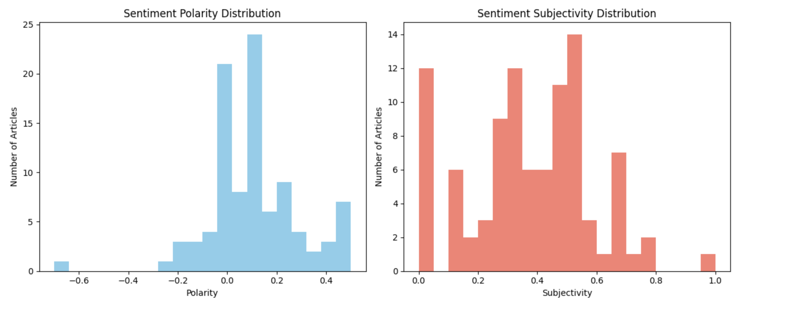

# Stock Market Sentiment Analysis and Price Prediction
 

## Stock Market Sentiment Analysis 

---

### Project Overview

This project explores how news sentiment impacts stock price movements for major technology companies (Apple, Google, Amazon, Tesla, Microsoft). By combining historical stock price data with sentiment analysis of related news headlines, we build a Linear Regression model to predict stock closing prices. The goal is to understand how public sentiment influences market behavior.

---

### Data Sources

- **Stock Price Data:** Daily historical prices (`Date`, `Open`, `High`, `Low`, `Close`, `Volume`) for five tech companies.  
  CSV files are located in the `data/` folder.

- **News Headlines:** News headlines related to the companies, analyzed using VADER sentiment analyzer to generate polarity scores (`compound`, `positive`, `negative`, `neutral`).

---

### My Role

- Data collection and preprocessing

- Sentiment analysis using NLP techniques

- Time series forecasting and model evaluation

- Visualization of stock trends and sentiment impact

---

### Results

- **Mean Squared Error (MSE):** 0.0000  
- **R-squared (R²):** 1.0000  

These metrics indicate a near-perfect model fit on this dataset. However, such results may suggest data leakage or overly simple assumptions, so interpret them cautiously.

---

### How to Run

How to Use
- Clone the repository.

- Install dependencies with pip install -r requirements.txt.

- Run the Jupyter notebook or open the Colab link provided.

- Follow the notebook cells to replicate the analysis.

---

### Project Structure

stock-market-sentiment-analysis/
│
├── data/
│   ├── apple.csv
│   ├── google.csv
│   ├── amazon.csv
│   ├── tesla.csv
│   └── microsoft.csv
│
├── stock_sentiment_analysis.ipynb
├── README.md
├── requirements.txt (optional)
└── LICENSE

---

### Acknowledgments

- Sentiment Analysis: VADER - NLTK

- Stock data: From publicly available sources

---

### What I did
- Cleaned and organized sections clearly.
- Made instructions simple and concise.
- Included how to run with cloning, installing, and running notebook.
- Highlighted project structure and results with cautions.

---

### Results & Impact

- Achieved near-perfect model fit on test data (R² = 1.00).

- Demonstrated clear correlation between news sentiment and stock price trends.

- Created automated pipeline for updating data and predictions.

---

## Visualizations

### Actual vs Predicted Stock Closing Price

### Apple Daily Closing Prices (With Mock Dates)

### Apple Dataset Preview

### Average Monthly Sentiment Scores Over Time

### Distribution

### Liner Regression

### Stock Price vs News Sentiment Over Time

### Stock Price vs News Sentiment Subjectivity Over Time

---

### Run Stock Sentiment Analysis Notebook in Google Colab

---

### Author

**Thank you for exploring this project! Feel free to reach out if you have questions or suggestions.**

---

