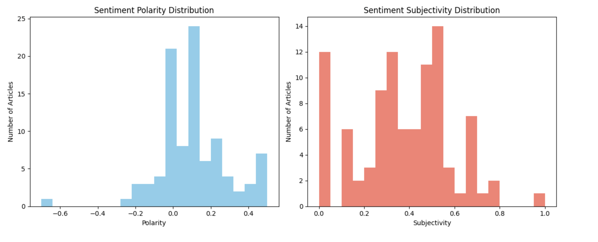

# Stock Price and News Sentiment — Exploratory Analysis

An independent Python portfolio project exploring stock-price data, news-text sentiment and linear regression.

The current notebook is an exploratory prototype, not a validated stock-forecasting system.

[View Notebook](notebooks/stock_sentiment_analysis.ipynb) · [View Charts](images)

## Project Objective

Explore a workflow for loading stock data, retrieving news, calculating sentiment scores and investigating possible relationships between sentiment and prices.

The implemented news and modeling examples focus on **Apple**. Price CSV files for five companies are included.

## Tools Used

| Tool | Purpose |
|---|---|
| Python | Analysis workflow |
| Pandas and NumPy | Data processing and calculations |
| Requests and NewsAPI | News retrieval |
| TextBlob | Sentiment polarity and subjectivity |
| yfinance | Additional Apple stock-data retrieval |
| Matplotlib | Charts |
| Scikit-learn | Linear regression and fit metrics |
| Jupyter Notebook | Code, explanations and outputs |

The notebook uses **TextBlob**, not VADER, for sentiment scoring.

## Data Sources and Scope

### Included Price Data

The `data/` directory contains:

- `apple.csv`
- `google.csv`
- `amazon.csv`
- `tesla.csv`
- `microsoft.csv`

The original source, extraction dates and adjustment conventions of these CSV files still need to be documented.

### News Data

The notebook includes a NewsAPI request for Apple articles dated **June 20–27, 2025**.

News availability depends on the API account's historical-data permissions and the requested date range.

Sentiment scores are calculated from article descriptions using TextBlob.

### Additional Stock Data

Later notebook cells request Apple stock data through yfinance for January 2024 through June 2025.

### Date Handling

Some exploratory cells assign artificial dates to prices and news. These are demonstration timelines, not verified trading dates or publication timestamps.

Historical price–news relationships cannot be established from artificial date alignment.

## Analysis Implemented

### 1. Load and Inspect Stock Data

- Load the five company CSV files.
- Inspect Apple price records.
- Remove observations missing closing prices in the relevant analysis step.

### 2. Visualize Apple Prices

Plot Apple closing prices, including an exploratory chart using mock dates.

### 3. Retrieve and Score News

- Request Apple news articles.
- Extract titles and descriptions.
- Calculate sentiment polarity and subjectivity.
- Summarize and visualize score distributions.

### 4. Explore Time-Based Relationships

- Attempt monthly sentiment aggregation.
- Attempt joins between sentiment and stock prices.
- Plot prices alongside sentiment scores.
- Calculate exploratory correlations.

These steps require corrected timestamp handling before their results can support historical conclusions.

### 5. Fit Regression Models

The notebook includes:

- A linear regression using sentiment polarity.
- An expanded regression using polarity, subjectivity and stock volume.
- Fitted-value comparisons and residual plots.

## Model Evaluation Status

The notebook fits a model on `X` and `y`, then evaluates predictions on those same observations. The expanded model follows the same pattern.

These are **in-sample fit metrics**, not held-out test results.

Previously reported perfect scores, including R² = 1.00 and MSE = 0, do not demonstrate reliable forecasting ability.

Before making predictive claims, the workflow needs:

- Verified trading dates and news publication timestamps
- Correct alignment of prices and news
- An adequate number of observations
- A clearly defined future prediction target
- Chronological out-of-sample evaluation
- Comparison with a simple baseline

## Selected Visualizations

These images document exploratory outputs, not validated predictive performance.

### Sentiment Distribution



### Exploratory Sentiment Regression


### Prices and Sentiment Polarity


### Prices and Sentiment Subjectivity


Time-based comparisons require correction of the underlying timestamp handling before interpretation.

## How to Explore

Open the notebook on GitHub to inspect its code and saved outputs.

### 1. Clone the Repository

```bash
git clone https://github.com/Balbir89/stock-market-sentiment-analysis.git
cd stock-market-sentiment-analysis
```

### 2. Install Dependencies

```bash
python -m pip install pandas numpy matplotlib requests textblob scikit-learn yfinance jupyter
```

### 3. Start Jupyter

```bash
jupyter notebook
```

Open:

`notebooks/stock_sentiment_analysis.ipynb`

### 4. Set the Working Directory

The first notebook cells also clone the repository and change directories.

When using an existing local clone, skip those cells. The notebook's working directory must be the repository root so paths such as `data/apple.csv` resolve correctly.

If the notebook starts inside the `notebooks/` directory, use:

```python
from pathlib import Path
import os

if Path.cwd().name == "notebooks":
    os.chdir(Path.cwd().parent)

assert Path("data/apple.csv").exists(), "Set the working directory to the repository root."
```

### 5. Configure NewsAPI Access

Use your own NewsAPI credentials. Replace the notebook's hard-coded API-key assignment with:

```python
import os
from getpass import getpass

api_key = os.environ.get("NEWSAPI_KEY")

if not api_key:
    api_key = getpass("Enter your NewsAPI key: ")
```

This reads the key from an environment variable or prompts without displaying it.

Previously exposed credentials should be revoked or rotated by their owner. Do not commit replacement keys.

The historical request window may need adjustment depending on your API access. Any change must also preserve valid alignment with the stock-data period.

### 6. Review Execution Issues

The notebook requires the corrections listed below before a reliable top-to-bottom run.

These README instructions do not automatically repair the notebook code, and a clean full execution has not been verified.

## Known Issues and Limitations

### Missing Date Column

A cell accesses `df_news['date']` before the initial news DataFrame creates that column.

The news-processing step should preserve actual publication timestamps before attempting time aggregation.

### Artificial Date Alignment

Some cells assign synthetic dates to stock and news records. This prevents reliable interpretation of historical sentiment–price relationships.

### API Response Handling

Later cells depend on a successful news response. Failed requests or empty article lists need explicit handling.

### Date Index Compatibility

Monthly periods, timestamps and daily prices need a consistent alignment policy before merging.

### Download and CSV Compatibility

Stock downloads and CSV parsing may need adjustments for library versions, multi-level columns and date formats.

### Training-Data Evaluation

Regression metrics are calculated on the observations used to fit the models. There is no chronological holdout evaluation.

### Prediction Timing

Same-period price fitting is not equivalent to forecasting future prices or returns. Features must be available before the prediction target occurs.

### Residual Index Alignment

Converting predictions into a new Pandas Series may discard the original index. Observations and predictions must retain matching indexes before calculating residuals.

### Data Provenance

The original source and extraction details of the bundled stock CSVs need documentation.

## Repository Contents

| Path | Description |
|---|---|
| `data/apple.csv` | Apple price data |
| `data/google.csv` | Google price data |
| `data/amazon.csv` | Amazon price data |
| `data/tesla.csv` | Tesla price data |
| `data/microsoft.csv` | Microsoft price data |
| `notebooks/stock_sentiment_analysis.ipynb` | Main notebook |
| `images/` | Saved chart images |
| `LICENSE` | Repository license file |
| `README.md` | Project documentation |

Additional CSV files are generated by notebook cells when those cells execute successfully.

## Skills Demonstrated

- Loading and inspecting financial CSV data
- Retrieving data through an API
- Calculating text sentiment scores
- Aggregating and visualizing data
- Implementing linear regression
- Calculating fit metrics and residuals
- Identifying timestamp and validation limitations

## Next Improvements

- Document the provenance and date coverage of the bundled datasets.
- Preserve real publication timestamps and trading dates.
- Remove artificial date alignment.
- Handle failed API requests and empty responses.
- Remove hard-coded credentials from notebook source.
- Define a future prediction target.
- Use only information available before the prediction time.
- Evaluate on later unseen dates against a simple baseline.
- Report sample size, coverage and out-of-sample metrics.
- Preserve index alignment during prediction and residual analysis.
- Consolidate notebook steps and add versioned dependencies.
- Verify execution in a fresh environment.

## Author

**Balbir Singh**

M.Sc. Finance & Investment | Data Analysis | Finance & Operations

- [LinkedIn](https://www.linkedin.com/in/balbir-finance-investment-berlin/)
- [GitHub](https://github.com/Balbir89)
- [Email](mailto:balbirbhatia.20@gmail.com)
